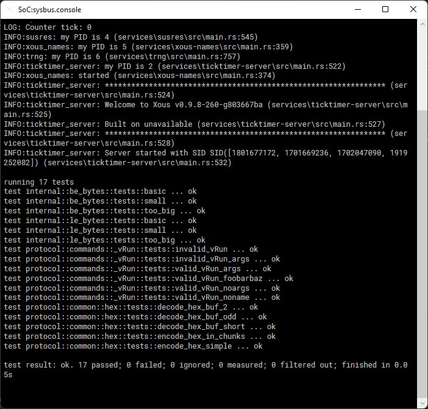

# Testing Crates

Cargo contains a built-in test runner. You can annotate functions with `#[test]` to indicate functions that should only be run in test mode:

```rust
#[test]
fn exploration() {
    assert_eq!(2 + 2, 4);
}
```

When you run `cargo test`, the build system will wrap each of these functions in a test harness and run them all in sequence. Importantly, these tests are all run in the same process, because the test harness is just an ordinary program with multiple "main" functions linked in.

## Testing Crates on Xous

The `cargo test` subcommand accepts a `--target` flag, as well as the `--no-run` flag to prevent actually running the code. All we have to do is compile tests for our target, then run that executable on real hardware or in Renode:

```sh
$ cargo test --target=riscv32imac-unknown-xous-elf --no-run
    Finished test [unoptimized + debuginfo] target(s) in 0.07s
  Executable unittests src/lib.rs (target/riscv32imac-unknown-xous-elf/debug/deps/gdbstub-7542e01db3053fd1)
$
```

By running this, the build system has created an ELF executable that we can load onto real hardware. The easiest way to incorporate it into real hardware is to use the `libstd-test` target as part of core:

```sh
$ cd ../xous-core/
$ cargo xtask libstd-test ../gdbstub/target/riscv32imac-unknown-xous-elf/debug/deps/gdbstub-7542e01db3053fd1
$
```

You can then run the resulting image in Renode or on real hardware

