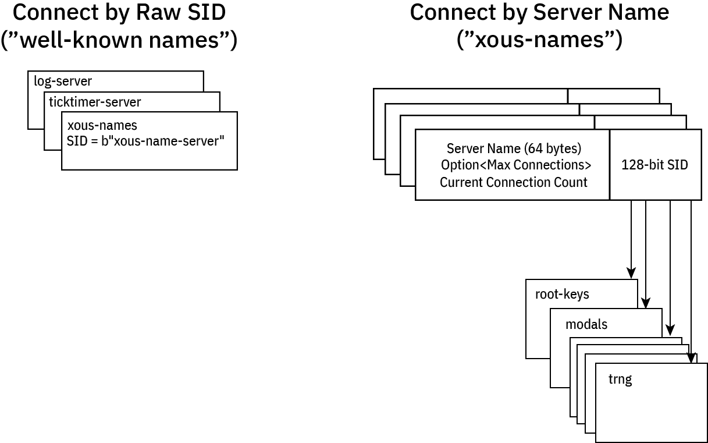

# Xous Names

Servers are identified by a 128-bit ID number in Xous. Anyone with knowledge of the 128-bit ID number can make requests to that server.

Some servers have "well-known names". These servers are designed to accept any number of connections and all of its APIs are considered safe for public use.

Other servers may have sensitive API calls. Their 128-bit IDs are treated as a secret.

In order to discover their ID, these servers register their ID in `xous-names`, along with a 64-byte `server name` which is a unique plaintext description of the server, and a `MaxConnections` which is the maximum number of processes allowed to connect to the registered server.



## Well-Known Names

A few servers have well-known names:

- log server: needed to debug name resolution issues
- ticktimer: in case you want to delay before connecting to a server
- Xous Names: the name server itself has a well known name
- Some `std` library servers, which should not be connected to directly by user processes but instead through `libstd` calls.

Well-known servers have a name like `b"xous-name-server"`, which reads like ASCII text but fits in exactly 128 bits: you just have to know the magic string, and you can connect to them.

Application programers will never need to know this name, because it is encapsulated within the objects that access the servers. For example, `XousNames::new()` "just knows" the name, so to access `xous-names` one simply needs to create a new `XousNames` object.

## Discovered Names

All other servers have their names registered as a 64-byte free-from `u8` array, which by convention maps to ASCII text (nothing prevents you from doing weird things that don't map to unicode, but, please don't). The resulting server ID is a crytpographically random 128-bit ID, which makes it effectively unguessable. Note that no checks are done for collisions with the "well known" names, because the chance that the TRNG would output the string `b"xous-name-server"` by chance is vanishingly small.

When registering a server, one might invoke a call like this:

```rust,noplayground
    let xns = xous_names::XousNames::new().unwrap();
    let net_sid = xns
        .register_name(api::SERVER_NAME_NET, None)
        .expect("can't register server");
```

or this:

```rust,noplayground
    let xns = xous_names::XousNames::new().unwrap();
    let keys_sid = xns
        .register_name(api::SERVER_NAME_KEYS, Some(3))
        .expect("can't register server");
```

Generally, the server name is defined as a string within the `api.rs` section, so that other crates can refer to it via the API. In the case of the `net` crate, the maximum connection limit is `None`, which means that any processes may connect to the `net` crate. In the case of the `root keys` crate, the number of connections to it is limited to 3 by the `Some(3)` argument.

In this case, the first three processes that attempt to connect to the `root keys` crate are handed out it's 128-bit server ID. Later processes that attempt to connect will be denied. This is a "trust on first use" model similar to how SSH maps host public keys to IP addresses.

Generally, sensitive servers like `root keys` are encapsulated by other processes that act as firewalls to it. So, if there were a hypothetical need to dole out derived keys from the `root keys` set, a second `derived keys` server might be created which can accept any number of connections, and one more connection would be added to the `root keys` connection count for the `derived keys` server. The `derived keys` server would thus act as a firewall to the `root keys` server.

Furthermore, as a rule, the number of processes created by a system must be static and known on boot in order for this system to work. This is because the most secure operations will not be allowed to be conducted until all of the servers that have specified a connection limit have their connection tables fully occuppied. Therefore it is not allowed to, for example for the hypothetical `derived keys` to connect to the `root keys` server at some point during runtime, and then de-allocate its connection when it no longer needs it. Instead, `dervied keys` should eagerly connect to the `root keys` on boot so that it can reserve and permanently hold its slot in the connection table.

The goal of this is to disallow a rogue or unexpected process from connecting to sensitive servers through the Xous Names discovery mechanism.