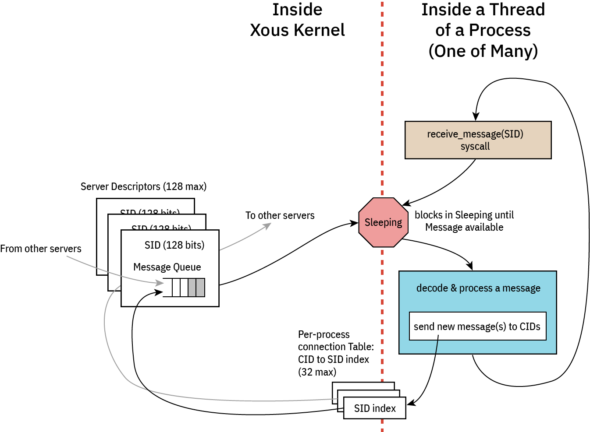

# Caller Idioms

There are two flavors of messages in Xous: `scalar` or `memory` messages. `scalar` messages are pass-by-register and have a limited size, but are very fast. `memory` messages are pass-by-memory, and can be large, but are slower.

There are (so far) four common types of caller patterns used in Xous:

1. Non-synchronizing: these are "fire and forget" messages that don't block(*) and have no synchronization guarantee.
2. Synchronous: these block and wait for a response from the callee. The caller can do nothing else until this message is handled.
3. Asynchronous: these don't block, and expect a response at some time later via a "push notification".
4. Deferred-response: these block the caller, but the callee is not allowed to block.

Type (1) is implemented using `send` on `memory` messages, or vanilla `scalar` messages on `scalar` types.

The remaining types will involve a `lend` or `lend_mut` on `memory` messages, or `blocking_scalar` on `scalar` types.

Before diving in, it is helpful to review the [messaging architecture](ch07-00-messages.md) of Xous:



Each server consists at its core of an event loop. While event loops are allowed to be non-blocking, this is an edge case and in general all event loops are blocking: when an event loop blocks, it is de-scheduled and consumes zero CPU resources, allowing us to stop the CPU clock and save power.

An incoming message will wake up the process, at which point the process shall decode and process the message. From here, the process may issue messages to other servers. Memory `send` and Scalar `scalar` messages will not stop the execution flow; the outgoing messages are simply placed in the destination queue and life goes on. However, blocking message types `lend`, `lend_mut`, and `blocking_scalar` will cause the message to be placed in the destination queue, and the current thread yields the remainder of its quanta to the destination thread. The blocked thread will remain stopped at that point of execution until the blocking message types are "returned". At this point the blocked thread is re-queued for execution. Execution will resume either on a time-based pre-emption boundary, or possibly earlier if the returning process completes its task before its quanta is up and enters a blocking state (that is, waiting on a new incoming message, or a response to a new outgoing blocking message).

⚡ Key Concept ⚡

Memory messages implicitly return to callers on `Drop`. Thus, there is no explicit "return" call in Xous for memory messages. Thus, one must use Rust's borrow checker to schedule the return. Specifically:

- Synchronous messages return as soon as the current message goes out of scope, e.g., at the bottom of the event loop.
- Deferred-response is implemented by binding the current message to an `Option<MessageEnvelope>` type that is external to the main event loop.
   - By sticking the message into a `Some()`, the message is not allowed to go out of scope, the `Drop` is never called, and thus the caller blocks.
   - However, the callee is free to continue on with its processing.
   - A return is triggered by calling `take()` on the enclosing `Option`. This moves the message out of the `Option` and into the current scope, where the message can now be modified with a return value. Once that operation ends, the message goes out of scope, `Drop` is called, and likewise, data is returned to the caller

⚠️ IPC Interoperability ⚠️

In many places Xous offers `usize` as arguments for IPC calls. This has a platform-dependent size, and in fact, the size can be different between caller and callee if you're passing messages between disparate hosts (which is actually a thing that is allowed on Xous).

For maximum compatibility, the recommendation is to restrict all IPC implementations to a `u32`-in-`usize`, unless you never intend to run on a 32-bit platform. **Note**: the target Precursor hardware is a 32-bit platform.

## Basic Template

With this overview, we can now give an example of each of the four types of messages. In general, we assume that services are organized into at least three files:

- `lib.rs` -- the caller-side API that formats native Rust data into IPC messages
- `main.rs` the server-side API that unpacks IPC messages and acts on them
- `api.rs` -- data structures & definitions shared between caller and callee

Note that none of these are mandatory -- for example, a pure client-side library like our AES implementation has only a `lib.rs`; and, an application that offers no services and has only a main function would have only a `main.rs`.

Below is an example of what these files might look like in a very minimal server implementation.

```rust,noplayground,ignore
// inside lib.rs
pub mod api;
pub use api::*;
use xous::{CID, send_message};
use num_traits::*;
use core::sync::atomic::{AtomicU32, Ordering};
static REFCOUNT: AtomicU32 = AtomicU32::new(0);

pub struct MyService {
    conn: CID,
}
impl MyService {
    pub fn new() -> Self {
        let xns = xous_names::XousNames::new().expect("couldn't connect to XousNames");
        REFCOUNT.fetch_add(1, Ordering::Relaxed);
        let conn = xns.request_connection_blocking(api::SERVER_NAME_MYSERVICE).expect("Can't connect to MyService");
        MyService {
            conn
        }
    }
    // ------ library methods to be discussed in detail below ------
}
/// Automatic disconnect on dropping the final instance of this connection
impl Drop for MyService {
    fn drop(&mut self) {
        if REFCOUNT.fetch_sub(1, Ordering::Relaxed) == 1 {
            unsafe{xous::disconnect(self.conn).unwrap();}
        }
    }
}
```

```rust,noplayground,ignore
// inside api.rs
pub(crate) const SERVER_NAME_MYSERVICE: &str     = "_Any descriptive and unique name under 64 chars_";

#[derive(num_derive::FromPrimitive, num_derive::ToPrimitive, Debug)]
pub(crate) enum Opcode {
    /// Define various operations here
    DoNonSync,
    // ------ API opcodes to be discussed in detail below ------
    /// Exits the server
    Quit,
}
```

```rust,noplayground,ignore
// inside main.rs
#![cfg_attr(target_os = "none", no_main)]

mod api;
use api::*;
use num_traits::*;

#[xous::xous_main]
fn xmain() -> ! {
    log_server::init_wait().unwrap();
    log::set_max_level(log::LevelFilter::Info);
    log::info!("my PID is {}", xous::process::id());

    let xns = xous_names::XousNames::new().unwrap();
    let sid = xns.register_name(api::SERVER_NAME_MYSERVER, None).expect("can't register server");
    loop {
        let msg = xous::receive_message(sid).unwrap();
        match FromPrimitive::from_usize(msg.body.id()) {
            Some(Opcode::DoNonSync) => xous::msg_scalar_unpack!(msg, _, _, _, _, {
                // do stuff here
            }),
            // ------ options to be discussed in detail below ------
            Some(Opcode::Quit) => {
                xous::return_scalar(msg.sender, 1).expect("couldn't ack quit");
                break;
            },
            None => log::error!("couldn't convert opcode: {:?}", msg),
        }
    }
    // clean up our program
    xns.unregister_server(sid).unwrap();
    xous::destroy_server(sid).unwrap();
    xous::terminate_process(0)
}

```

With the above template in mind, click on the following for examples of each of the four patterns, broken down into each of `Scalar` and `Memory` types when applicable.

- [Non-synchronizing](ch07-03-nonsynchronizing.md)
- [Synchronous](ch07-04-synchronizing.md). Includes an example of how to use raw messages (instead of `rkyv`) for serializing data.
- [Asynchronous](ch07-05-asynchronous.md) or "push notifications"
- [Deferred response](ch07-06-deferred.md)
- [Forwarding messages](ch07-07-forwarding.md)