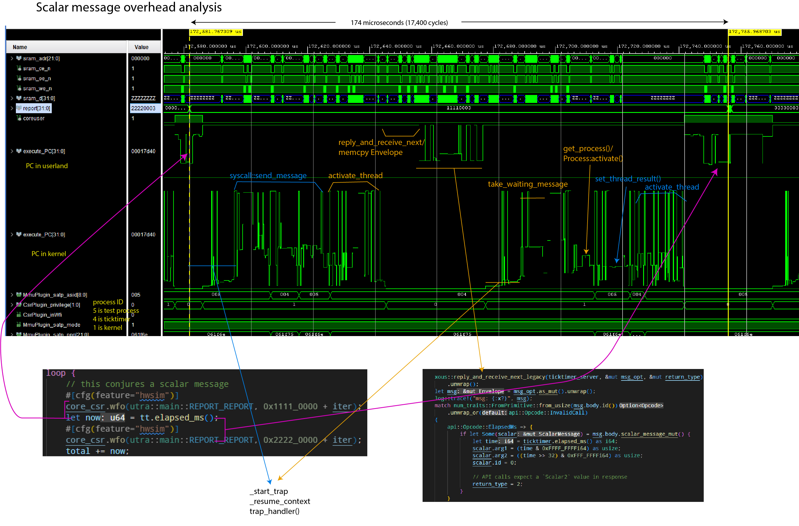
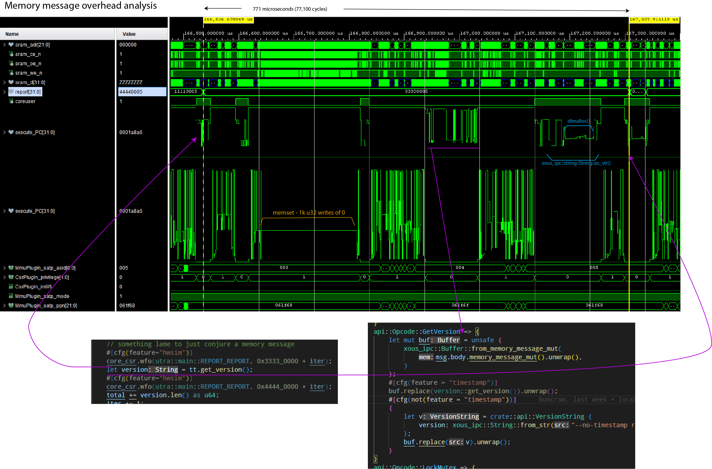
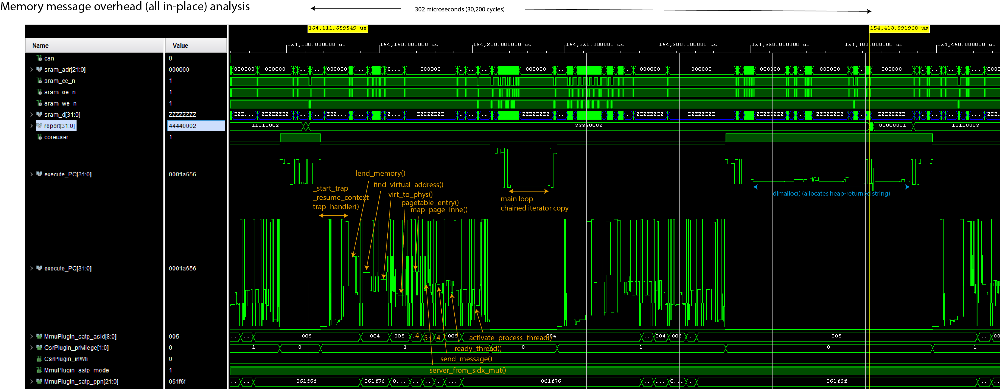

# Messaging Performance

On a 100MHz VexRiscv RV32-IMAC, 4k/4way I/D L1 writethrough cache + unified 128k L2 writethrough cache, and cycle-accurate models for external SRAM (70ns access times) and SPINOR FLASH (200 MT/s):

  - A round-trip call with a scalar message takes 174 microseconds
  - A round-trip call with a memory message typically takes 771 microseconds, but can be optimized down to 302 microseconds

The waveforms presented in this section are derived from a cycle-accurate verilog simulation of something fairly close to a Precursor device.

## Scalar Message Performance

Scalar messages can move up to 5 32-bit words (20 bytes) in a single call, using the `scalar5` message type available in the `reply_and_receive_next()`, introduced in release 0.9.11. Prior to that, up to 2 32-bit words could be moved. It takes the same amount of time whether you move 0 words, or 5 words either way.

The following is a graphical breakdown of the overhead of sending a scalar message.



Notes:
  - The `report[31:0]` field helps track client code location.
  - `execute_PC` is plotted twice; once showing the range of userland code, once showing the range of kernel code
  - `MmmuPlugin_satp_asid` is the active process ID. `5` is the client loop; `4` is the ticktimer server; `1` is the kernel

The simulation was run using Xous 0.9.12, with the following code running:

Client code:
```rust,noplayground,ignore
    // Code in the client main loop
    core_csr.wfo(utra::main::REPORT_REPORT, 0x1111_0000 + iter);
    let now = tt.elapsed_ms();
    core_csr.wfo(utra::main::REPORT_REPORT, 0x2222_0000 + iter);

    // Code in the library call
    pub fn elapsed_ms(&self) -> u64 {
        let response = send_message(
            self.conn,
            xous::Message::new_blocking_scalar(
                api::Opcode::ElapsedMs.to_usize().unwrap(),
                0,
                0,
                0,
                0,
            ),
        )
        .expect("Ticktimer: failure to send message to Ticktimer");
        if let xous::Result::Scalar2(upper, lower) = response {
            upper as u64 | ((lower as u64) << 32)
        } else {
            panic!(
                "Ticktimer elapsed_ms(): unexpected return value."
            );
        }
    }
```

Server code:
```rust,noplayground,ignore
    // Code on the server main loop
    api::Opcode::ElapsedMs => {
        if let Some(scalar) = msg.body.scalar_message_mut() {
            let time = ticktimer.elapsed_ms() as i64;
            scalar.arg1 = (time & 0xFFFF_FFFFi64) as usize;
            scalar.arg2 = ((time >> 32) & 0xFFF_FFFFi64) as usize;
            scalar.id = 0;

            // API calls expect a `Scalar2` value in response
            return_type = 2;
        }
    }
    // Hardware abstraction code, down to the register read/writes
    pub fn elapsed_ms(&self) -> u64 {
        self.raw_ticktime() / TICKS_PER_MS
    }
    pub fn raw_ticktime(&self) -> u64 {
        let mut time: u64 = self.csr.r(utra::ticktimer::TIME0) as u64;
        time |= (self.csr.r(utra::ticktimer::TIME1) as u64) << 32;
        time
    }

```

## Memory Message Performance

Memory messages can move up to the available free memory in a single call. However, the minimum amount of memory that can be moved in any case is one page (4096 bytes).



Notes:
  - The `report[31:0]` field helps track client code location.
  - `execute_PC` is plotted twice; once showing the range of userland code, once showing the range of kernel code
  - `MmmuPlugin_satp_asid` is the active process ID. `5` is the client loop; `4` is the ticktimer server; `1` is the kernel

The simulation was run using Xous 0.9.12, with the following code running:

```rust,noplayground,ignore
    // Client main loop code
    core_csr.wfo(utra::main::REPORT_REPORT, 0x3333_0000 + iter);
    let version = tt.get_version();
    core_csr.wfo(utra::main::REPORT_REPORT, 0x4444_0000 + iter);

    // Client library code
    pub fn get_version(&self) -> String {
        let alloc = api::VersionString {
            version: xous_ipc::String::new(),
        };
        let mut buf = xous_ipc::Buffer::into_buf(alloc).expect("couldn't convert version request");
        buf.lend_mut(self.conn, api::Opcode::GetVersion.to_u32().unwrap())
            .expect("couldn't get version");
        let v = buf
            .to_original::<api::VersionString, _>()
            .expect("couldn't revert buffer");
        String::from(v.version.as_str().unwrap())
    }
```

Server code:
```rust,noplayground,ignore
    // Main loop code
    api::Opcode::GetVersion => {
        let mut buf = unsafe {
            xous_ipc::Buffer::from_memory_message_mut(
                msg.body.memory_message_mut().unwrap(),
            )
        };
        buf.replace(version::get_version()).unwrap();
    }
    // Library to retrieve the version number
    pub(crate) fn get_version() -> crate::api::VersionString {
        let mut v = crate::api::VersionString {
            version: xous_ipc::String::new()
        };
        v.version.append(SEMVER).ok();
        v.version.append("\n").ok();
        v.version.append(TIMESTAMP).ok();
        v
    }
    pub const TIMESTAMP: &'static str = "Wed, 18 Jan 2023 19:19:24 +0800";
    pub const SEMVER: &'static str = "v0.9.11-152-g277d014f";
```

A couple things are remarkable about this call:
  - A large amount of time is spent clearing the 4096-byte page of memory to 0, even though only about 53 bytes are transferred. On this implementation, the zero-clearing time is bottlenecked by the write speed to main memory, and by the write-through caching scheme. Faster main memory and/or a write-back cache would reduce the zeroization time.
  - A large amount of time is spent in `dlmalloc()` to heap-allocate the return string.

Thus, while the code is ergonomic, there is a price for the abstractions.

## Optimizing Memory Message Performance

One can speed up memory messaging with a few techniques:
  - Use stack-allocated, explicitly managed and `unsafe` regions of memory (warning: by not zeroizing the whole page every time, one runs the risk of leaking previously sent data to third parties. It is not recommended to do this unless you are very careful!)
  - Avoid heap allocations at all costs

Below is the same run of code, but with these optimizations. The round-trip call time drops from 771us to 302us.



However, the code turns into this:

```rust,noplayground,ignore
    // Client main loop code
    core_csr.wfo(utra::main::REPORT_REPORT, 0x3333_0000 + iter);
    let version = tt.get_version();
    core_csr.wfo(utra::main::REPORT_REPORT, 0x4444_0000 + iter);

    // Client library code
    // Define a struct that's 4096 bytes of `u8` and ensure it's page-aligned
    #[derive(Debug)]
    #[repr(C, align(4096))]
    struct StringRequest([u8; 4096]);

    #[derive(Debug)]
    pub struct Ticktimer {
        // ...
        request: UnsafeCell::<StringRequest>,
    }
    pub fn new() -> Result<Self, Error> {
        // ...
        Ok(Ticktimer {
            // ...
            request: UnsafeCell::new(StringRequest([0u8; 4096])),
        })
    }

    pub fn get_version(&self) -> String {
        // Send the message mutably, indicating that there are 4096 bytes available. The
        // Server will overwrite some number of bytes and return the value in the `.valid`
        // field.
        let request = self.request.get();
        let memory_range = unsafe {
            xous::MemoryRange::new(
                request as usize,
                core::mem::size_of::<StringRequest>(),
            )
            .unwrap()
        };
        let result = send_message(
            self.conn,
            xous::Message::new_lend_mut(
                api::Opcode::GetVersion as _,
                memory_range,
                None, xous::MemorySize::new(4096))).unwrap();

        // Extract the `offset` and `valid` fields
        let valid = match result {
            xous::Result::MemoryReturned(_offset, valid) => valid.unwrap(),
            _ => panic!("Invalid return value"),
        };

        // Convert the stack array into a heap-allocated Vec<u8>
        let data = unsafe{(&*request).0[0..valid.get()].to_owned()};

        // Reassign the heap-allocated Vec<u8> to the String, and return it.
        // If there is a UTF-8 error, this will panic.
        String::from_utf8(data).unwrap()
    }
```

In this case, the `Ticktimer` object statically allocates, and keeps for the lifetime of an object,
a page-aligned "hole" in the stack that is tracked by the `StringRequest` structure. The `UnsafeCell`
wrapper is necessary to do runtime borrow checking, so that the API call for `get_version()` is not
`mut`.

`StringRequest` is initialized to `0` once on `new()`, and future calls simply re-use and overwrite the memory region
(in fact, since the version data is static, the page could even be pre-populated with the version
return data, but this example dynamically populates it to give a more realistic example of how to
use this optimization in practice).

Note that this causes the object to "eat" at least 4096 but more typically closer to 8192 bytes
(whereas previously it was a single `u32` plus some Rust book-keeping); so, it is inefficient in
RAM, less safe, but completely avoids the problem of allocating a page and zeroizing it.

Server code:
```rust,noplayground,ignore
    // Main loop code
    api::Opcode::GetVersion => {
        let mut raw_msg = msg.body.memory_message_mut().unwrap();
        raw_msg.valid = core::num::NonZeroUsize::new(
            crate::version::SEMVER.len() + 1 + crate::version::TIMESTAMP.len());
        let mut buffer = raw_msg.buf.as_slice_mut();
        for (dest, src) in buffer.iter_mut()
                .zip(crate::version::SEMVER.as_bytes().iter()
                .chain([b'\n'].iter())
                .chain(crate::version::TIMESTAMP.as_bytes().iter())) {
            *dest = *src;
        }
    }

    api::Opcode::GetVersion => {
        let raw_msg = msg.body.memory_message_mut().unwrap();
        let mut v = String::new();
        v.push_str(crate::version::SEMVER);
        v.push_str("\n");
        v.push_str(crate::version::TIMESTAMP);
        let len = v.as_bytes().len();
        raw_msg.buf.as_slice_mut()[..len].copy_from_slice(v.as_bytes());
        raw_msg.valid = Some(core::num::NonZeroUsize::new(len).unwrap());
    }    // Library to retrieve the version number
    pub const TIMESTAMP: &'static str = "Wed, 18 Jan 2023 19:19:24 +0800";
    pub const SEMVER: &'static str = "v0.9.11-152-g277d014f";
```

In this case, the server is directly accessing the page of memory lent from
the client, and copying the return data into the underlying `[u8]` of the memory
message. It uses one of the advisory fields (in this case, `valid`) to note
how long the return data is (recall that `valid` and `size` have no fixed
meaning are are available to the API writer to annotate the contents of the
re-mapped memory page).

Fortunately for this example, we're just returning a `String`, which deserializes
natively with `as_bytes()`; but more complex datatypes will require some sort
of serdes implementation. The `Buffer` abstraction uses `rkyv` as the `serdes`
layer, but by going straight to the underlying slice data, a user can use
their own preferred serdes format, or if their data happens to be already in
a slice-u8 format, they can completely bypass the serdes abstraction layer entirely.

Thus, one can optimize memory messages to be about 2x faster by stripping off
much of the ergonomics that surround memory messages, but it is trickier to guarantee
correctness, there is a very real risk of leaking data between processes (through
unused data in borrowed pages not being zero-ized), and at a higher static memory
cost.

Finally, one can see that because the return type of the API call is `String`,
there is still a fairly substantial `dlmalloc()` penalty in the loop, where
a chunk of heap memory is conjured to meet the requirements of the `get_version()`
API. Returning an `&str` would remove that step, but then you have lifetime and
ownership ergonomics to contend with for that reference on the return.
