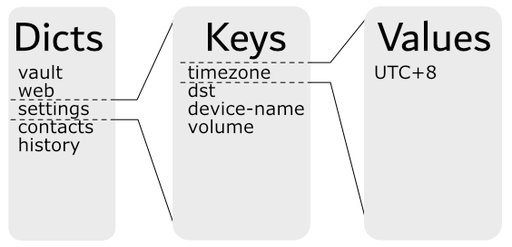

# The Plausibly Deniable DataBase (PDDB) Overview

The Plausibly Deniable DataBase ([PDDB](https://www.bunniestudios.com/blog/?p=6307)) is Xous' filesystem abstraction. It plays the role that a filesystem like `FAT` or `ext4` might play in other OSes, combined with full disk encryption like `LUKS` or `VeraCrypt`. It also features "plausible deniability", which aims to make it difficult to prove "beyond a reasonable doubt" that additional secrets exist on the disk, even in the face of forensic evidence.

The PDDB can be accessed through a native API, or through Rust's `std::fs::File` layer. `std::fs::File` enables applications and libraries that are "naive" to deniability to run. Applications are free to mix-and-match between native and `std::fs::File` calls, and in most cases will deliver a less confusing and safer user experience if they are written with deniability built into the user work flow.

The PDDB is structured as a `key:value` store divided into `dictionaries` that features multiple overlay views. Each overlay view is called a `Basis` (plural Bases). A Basis has the following properties:

 - The current view is the union of all open Bases
 - In case of namespace conflicts (two keys with the same name in a dictionary):
   - For reads, the value in the most recently unlocked Basis is returned
   - For writes, the value updates an existing key (if one exists) in the most recently unlocked Basis; otherwise, a new key is created in the most recently unlocked Basis.
   - In all cases, the API supports specifically naming a target Basis. This overrides the defaults specified above
 - The default Basis is named `.System`, and it is created when the PDDB is formatted. The PDDB is considered mounted if the `.System` Basis can be found.
 - When a Basis is locked, its data is indistinguishable from free space and hence plausibly deniable.
 - A Basis is unlocked by a name and password combo. If either are lost or forgotten, the Basis is equivalent to having been deleted.

One may also see the use of the term "enumerated" instead of "unlocked" in reference to a Basis. "Enumeration" refers to when the used space of a Basis is disclosed, but none of the core data structures are mounted. Typically the encryption keys are zeroized after enumeration. "Unlocking" refers to when the Basis is fully mounted, and its decryption keys and dictionary root records are cached in memory until the Basis is locked.

The PDDB documentation is structured into several chapters.
  - [Basis Internal Structure](ch09-01-basis.md) does a deep-dive into the internal mechanics of the PDDB
  - [Key Derivation](ch09-02-rootkeys.md) outlines how the keys that secure the PDDB are derived
  - [Native API](ch09-03-api-native.md) is targeted at application developers who want to use native API calls
  - [Std API](ch09-04-api-std.md) is targeted at application developers who want to use `std::fs::File` calls
  - [Testing](ch09-05-testing.md) is targeted at kernel developers tracking down bugs in the PDDB
  - [Backups](ch09-06-backups.md) touches on how to extract data from backups made using the backup tool
  - [Discussion](ch09-07-discussion.md) covers issues affecting the security and deniability of the PDDB

