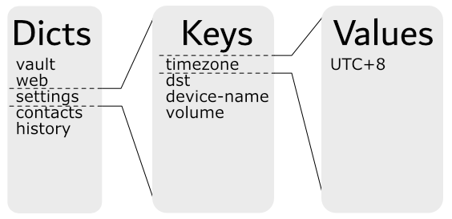
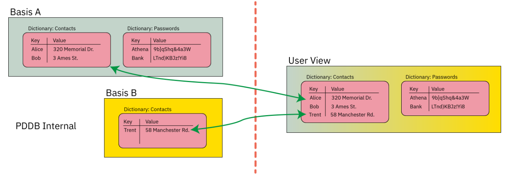
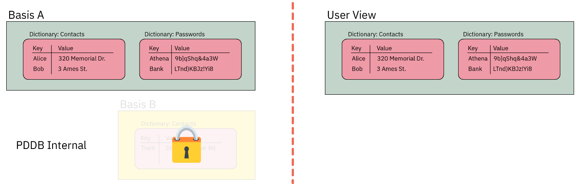
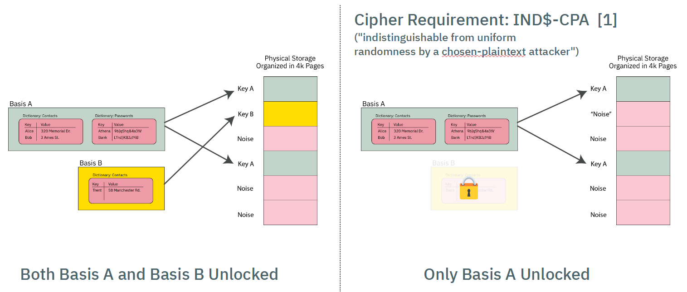
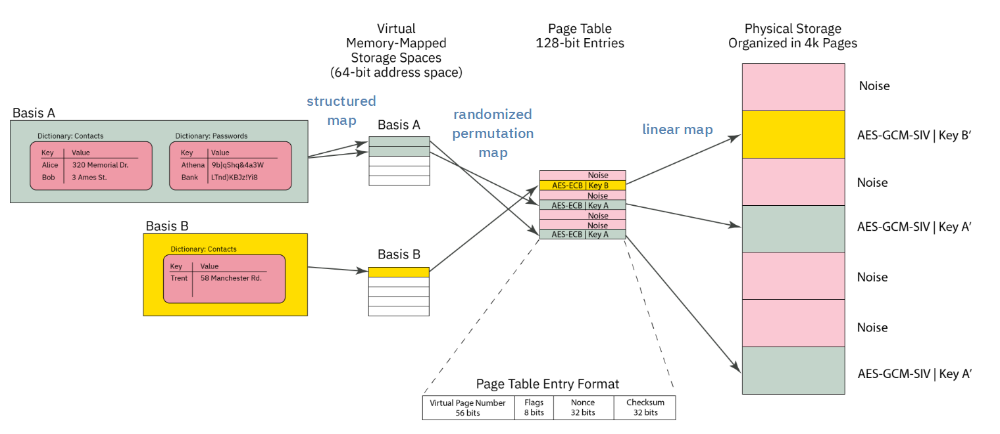
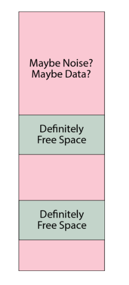

# Basis Internal Structure

## Overview

From an external API standpoint, users see the PDDB as a set of dictionaries containing keys:

This chapter goes behind the scenes and explores the internal structure, and how the Bases are allocated to provide multiple overlay views into the simplified example above.

## A Short Example

Below is a contrived example of a PDDB consisting of two dictionaries, `Contacts` and `Passwords`, and two Bases, `Basis A` and `Basis B`:

The "User View" of the PDDB is the union of the data contained in `Basis A` and `Basis B`.

If the user were to lock `Basis B`, the "User View" would now lack the data contained within `Basis B`:

Furthermore, each Basis is implemented using ciphers that have a particular characteristic, namely, [IND$-CPA](https://web.cs.ucdavis.edu/~rogaway/papers/ad.pdf): the ciphertext is indistinguishable from random noise. AES-GCM-SIV has this property (and if I'm not mistaken, provably indistingishable, but ask a cryptographer for the latest research).

Thus, when a Basis is locked, its data pages look indistinguishable from other pages in the PDDB storage area that have previously initialized with "noise" (more specifically, the output of a ChaCha8 CSPRNG that conditions the joint output of two TRNGs, a ring oscillator and an avalanche generator).

This quality of indistinguishability from free space is the source of plausible deniability. Side channels such as free space and API-level leakage degrade the amount of plausible deniability. See the chapter on [Security and Deniability](ch09-07-discussion.md) for an in-depth discussion on deniability attacks and mitigations.

## Orthogonal Virtual Page Table Structure

### Page Table Format

The simplified diagram above would require a user to scan every page of storage and trial-decrypt each page to discover the full extent of user data. It also lacks an index to track what data goes where.

These two problems are solved by using a classic "page table" mechanism to map Basis data onto the actual storage array. The virtual memory space of any given Basis is 64 bits, with pages that are 4064 bytes long (this is 4096 physical bytes less a per-page overhead for AEC-GCM-SIV + journaling)

The page table itself consists of entries that are 128-bits long (sized to match the length of an AES block), that are encrypted with AES-ECB.

Each page table entry is encodes the following data:

- 52-bit virtual page number of the physical page corresponding to the offset of the page table, stored as a 56-bit zero-padded field.
- 8 bits of flags
- 32-bit nonce (see [discussion](ch09-07-discussion.md#page-table-collision-leakage) on collisions)
- 32 bit `murmur3` hash checksum

AES-ECB is tricky to use. However, it is fast, and requires no dependency to adjacent blocks. A nonce is provided to frustrate known-plaintext attacks. There is a trade-off between nonce size, checksum length, and fitting everything within a single AES block. The 32-bit nonce does not provide perfect collision resistance, but the potential leakage is hypothesized to be much smaller than other known side channels in the architecture. The impact of a collision is also negligible: an attacker will know that they have discovered a ciphertext that corresponds to a valid page table entry, but they don't know to which Basis or to what address.

The page table entry is also protected with a 32-bit murmur3 hash checksum that is not meant to be a cryptographic check; it is instead a fast "go/no-go" check on the potential validity of a page table entry. A page table entry is only considered fully valid until the corresponding data section also decrypts to the data key. The data sections are protected with a proper cryptographic-strength MAC via AES-GCM-SIV, so it's not a problem if we get occassional false-positives on the page table. In practice, false-positives turn into pages that are allocated-to-nowhere, e.g. the space never gets used to store useful data.

Thus the page table entry has the following characteristics:

- Maps physical pages to virtual pages
- Fits in an AES block
- Is quick to check for definitely invalid entries, but has a low false-positive rate that can be verified with a fully cryptographic MAC.
- Has some protection against known-plaintext attacks; some leakage of information is expected, but is of minor consequence

### Page Table Orthogonality

All Bases share storage for their page table entries in the same page table, and each Basis has an identical virtual address space. Collisions of Bases are avoided (that is, the Bases are orthogonal) because the 256-bit AES key used to encrypt each page table entry is different. Thus, even if the plaintext of a page table entry is identical between several Bases, each Basis has a different AES key, and thus no Basis can accidentally decrypt the page table entry of another Basis.

Thus, when a Basis is "mounted", the first operation is to take the `page table key` and trial-decrypt every block in the page table region. Blocks whose checksum match (along with a few other consistency properties) are populated into a `HashMap` that forms a candidate page table mapping for a given Basis. For Precursor's 98MiB PDDB, this means every time a Basis is mounted, about 25,000 AES blocks corresponding to as many pages need to be decrypted and trialed. This is a reasonably fast operation, thanks to the hardware AES engine, taking a couple of seconds total.

## Virtual Memory Layout

The virtual memory layout of every Basis is identical.

A `VPAGE` in Basis space is is 0xFE0 (4,064) bytes long, which is equal to a `PAGE` of 4096 minus 32 bytes of encryption + journal overhead.

4064 is nice because it has convenient factors: 1, 2, 4, 8, 16, 32, 127, 254, 508, 1016, 2032, 4064.

The BasisRoot is located at `VPAGE` #1 (`VPAGE` #0 is always invalid, to make `Option`s zero-cost).

It contains a count of the number of valid dictionaries in the Basis. Dictionaries are found at
fixed offsets starting at 0xFE_0000 and repeating every 0xFE_0000 intervals, with up to 16383 dictionaries
allowed. A naive linear search is used to scan for dictionaries, starting at the lowest address,
scanning every 0xFE_0000, until the correct number of dictionares have been discovered. A dictionary can be effectively deleted by marking its descriptor as invalid.

A stride of 0xFE_0000 means that dictionary descriptors can be up to 4096 VPAGEs long. A dictionary
descriptor consists of a `DictDescriptor` header, some bookkeeping data, plus a count of the number
of keys in the dictionary. Following the header is a list of key descriptors. Similar to the Descriptors,
the key descriptors are stored at a stride of 127 (or 32 per `VPAGE`); they can be deleted by being marked
as invalid, and a linear scan is used to identify all the entries. A KeyDescriptor contains the name
of the key, flags, its age, and pointers to the key data in virtual memory space + its length.
This leads to a name length restriction of roughly 115 characters for keys and dictionaries, which is
about half of what most filesystems allow, but accommodates roughly 99.99% of the use cases.

Thus adding a new dictionary always consumes at least one 4k page, but you can have up to 15 keys
in that dictionary with no extra bookkeeping cost, once the first dictionary is added.

Each `VPAGE` is encrypted with AES-GCM-SIV, takes "Additional Authenticating Data", or AAD. The AAD associated with the BasisRoot consist of a bytewise concatenation of:
  - Basis name
  - Version number (complicates downgrade attacks)
  - FPGA's silicon DNA number (makes a naive raw-copy of PDDB data to another device unusable;
    but of course, the DNA ID can be forged)

Here are some of the assumptions that went into designing the PDDB:

  - Most mutability happens on the data keys themselves (keys are read/write/modify routinely).
  - Dictionary modifications (key addition or removal) are about 20x less frequent than key mods.
  - Basis modifications (creation/removal of dictionaries) is about 10x less frequent than dictionary .
  - According to https://www.pdl.cmu.edu/PDL-FTP/HECStorage/Yifan_Final.pdf, 0.01% of files (1 in 10,
    require a name over 100 bytes long; 0.1% require longer than 64 bytes. There longest filename tified
    was 143 bytes long. Study surveys ~14M files on the LANL network.
  - Same study says 99.9% of directories have under 1k files, 99.999% under 10k

### Basis Virtual Memory Layout

|   Start Address        |  Description                              |
|-----------------------:|-------------------------------------------|
| 0x0000_0000_0000_0000  |  Invalid -- `VPAGE` 0 reserved for `Option<>` |
| 0x0000_0000_0000_0FE0  |  Basis root page                          |
| 0x0000_0000_00FE_0000  |  Dictionary[0]                            |
|                    +0  |  … Dict header (127 bytes)              |
|                   +7F  |  …… Maybe key entry (127 bytes)          |
|                   +FE  |  …… Maybe key entry (127 bytes)          |
|              +FD_FF02  |  …… Last key entry start (128k possible) |
| 0x0000_0000_01FC_0000  |  Dictionary[1]                            |
| 0x0000_003F_7F02_0000  |  Dictionary[16382]                        |
| 0x0000_003F_8000_0000  |  Small data pool start  (~256GiB)         |
|                        |  … Dict[0] pool = 16MiB (4k vpages)     |
|                        |  …… SmallPool[0]                       |
|                  +FE0  |  …… SmallPool[1]                       |
| 0x0000_003F_80FE_0000  |  … Dict[1] pool = 16MiB                 |
| 0x0000_007E_FE04_0000  |  … Dict[16383] pool                     |
| 0x0000_007E_FF02_0000  |  Unused                                   |
| 0x0000_007F_0000_0000  |  Medium data pool start                   |
|                        |  … TBD                                  |
| 0x0000_FE00_0000_0000  |  Large data pool start  (~16mm TiB)       |
|                        |  …… Demand-allocated, bump-pointer; currently no defrag       |
|                        |                        |

### Memory Pools

Key data is split into three categories of sizes: small, medium, and large; but the implementation
currently only handles small and large keys. The thresholds are subject to tuning, but
roughly speaking, small data are keys <4k bytes; large keys are everything else.

Large keys are the simplest - each key starts at a `VPAGE`-aligned address, and allocates
up from there. Any unused amount is wasted, but with a ~32k threshold you'll have no worse
than 12.5% unused space, probably closer to ~7%-ish if all your data hovered around the threshold.
The allocation is a simple pointer that just keeps going up. De-allocated space is never defragmented,
and we just rely on the space being "huge" to save us.

Small keys are kept in `VPAGE`-sized pools of data, and compacted together in RAM. The initial, naive
implementation simply keeps all small keys in a `HashMap` in RAM, and when it comes time to sync them
to disk, they are sorted by update count, and written to disk in ascending order.

Medium keys have a TBD implementation, and are currently directed to the large pool for now.

### Size Limits

The biggest key the PDDB can handle, at least in this version, 32GiB. No, this is not
web scale, but it's big enough to hold a typical blu-ray movie as a single key.

One can adjust this constant up or down, and the trade-off is, you get more or less total number of large keys allocated over the life of the filesystem. This is because we simply "increment a pointer" when a new large key is added to create the next virtual memory spot for the large file, meaning each key get allocated a full 32GiB of virtual memory space for it to grow into.

At 32GiB, you can create a lifetime total of about 200 million keys (this includes keys you've previously deleted, until we create a mechanism for sweeping through the memory space and tracking de-allocations).

Note that a "large" keys includes anything over 4kiB, so if you create a 5kiB file, it can potentially grow to 32 GiB without bumping into the next large file.

This is a very "lazy" way to deal with large files. Given that the PDDB is initially designed for a 32-bit device with only 128MiB of memory and a read/write lifetime of 100k cycles for the FLASH, 200 million file allocations is probably greater than the lifetime of the device itself. If the PDDB migrates to a larger handphone-style application, I think it'll probably still hold up OK with 200 million total large file allocations over the device lifetime and a limit of 32GiB. That's about 73k files created per day for 10 years, or about 50 files per minute -- roughly one new file per second for 10 years straight before the PDDB runs out of virtual memory space.

A web server creating a >4k temporary log file for every client that hit and then deleting it
would probably crush this limit in months. So don't use the PDDB to back a high volume web server.
But it's probably OK for a consumer electronics device with a typical lifetime of less than 10 years.

If you really think you want larger files and also more write life, you'd need to implement an in-memory
"free" file allocator, but honestly, this is not something I think we need to burn resources on for
the initial target of the PDDB (that is, a 100MiB device with 100k read/write endurance lifetime).
Anyways, the code is written so one can just slide this constant up or down and change the behavior
of the system; it's recommended you reformat when you do that but I /think/ it should actually be OK
if you made a change "on the fly", because the bump allocator only cares about the size of data it intends to allocate, and disregards everything in the past.

Also note that in practice, a file size is limited to 4GiB on a 32-bit Precursor device anyways
because the `usize` type isn't big enough. Recompiling for a 64-bit target, however, should give
you access to the full 32GiB file size limit.

### RAM Pressure

The PDDB retains in RAM a page table for every Basis. There are about 25,000 potential pages on a Precursor device, and there are no duplicate pages between Bases; thus, it's estimated that the page table structure may take about 500kiB of space at its largest.

In addition to the page tables, the PDDB agressively caches all "small" keys. The current implementation assumes that any small key is always "hot" in cache, and the disk is just a write-through backing store in case power is lost. In practice, the heap size limit of the PDDB server is about 2MiB, so, the system should crash if one starts to push around a megabyte total of small key data. That's about 256 exactly 4k-sized keys, but typically small keys are very small, about 32 bytes, so the practical limit is probably closer to 10k-20k 32-byte keys.

Large keys consume about one 4k-page per key, regardless of the key size. Large keys only retrieve their data when requested, and will keep only the most recently accessed page in RAM, regardless of the size of the large key. Thus one could store a several-megabyte file in a large key, and not worry about blowing out the cache.

However, because the large key cache is so simple, it has performance problems, especially for situations where one plans to access large key data randomly, or in the worst case, they are accessing bytes that happen to cross a page boundary -- every time you cross the boundary, the old page is forgotten, and the new page is read in.

The caching mechanism can be improved down the road, but, at the moment for an application like `vault`, the current implementation should be more than adequate to handle hundreds of password records.

### The "Make Before Break" (MBBB) Structure

In order to protect against data loss in case of an untimely power outage, several pages of FLASH is devoted to the "make before break" feature. The core problem is that a single erase page of the page table contains records for 256 page table entres. If there is a power outage while updating one of the entries, all of the other 255 entries are also lost.

Thus, the MBBB mechanism creates a shadow area where the page table page being updated can be copied, prior to erasing it.

Initially, the MBBB area is blank (all `FF`'s). When a page table entry needs to be updated, the whole page containing the entry is copied to a random sector in the MBBB (the randomness is for wear-levelling, not security) *with* the changes applied, and then the page containing the page table entry is erased.

When the next page table entry needs to be updated, the MBBB page table image is then written to the blank slot in the page table, and the process repeats.

There is no mechanism to record where the MBBB page is:
- The MBBB area is only consulted if a blank page is found in the page table
- "Blankness" of an area is determined by only consulting the first 16 bytes and checking if they are 0xFF. If it is, the entire page is considered blank.
- The MBBB area may only contain 0 or 1 backup pages. Thus, when it is consulted, the algorithm searches for the first non-blank page and uses that as the MBBB page.

## Free Space

Plausible deniability is all about reducing the number of side channels that can leak information about the existence or non-existence of secret data. The amount of free space in the PDDB is a potent side channel. If the true amount of free space could be known, an adversary can use that to deduce the existence or non-existence of additional secrets within the PDDB beyond the ones revealed to the adversary.

The PDDB's solution to this is to create a cache of free space that represents a defined fraction of the total true free space. The parameters are tunable, but in v0.9.9 the default parameters are to allocate 50% +/- 10% of the true free space toward the free space cache, known as the FSCB ("Fast Space Cache Buffer"). The +/-10% is a fudge factor that is determined by the TRNG. Thus, the situation for free space in the PDDB looks a bit like the schematic shown below, where the pink areas are "maybe noise? maybe data?" and the gray areas are "definitely free space" (the actual situation is much more fragmented, this is just a cartoon).

An adversary can thus query the FSCB and know that, for example, a device may currently have about 20% of the total capacity as free space. However, they cannot say for sure that this means that the device is 80% full -- it could also be that the device is 30% full, and the FSCB was never refilled after the initial format; or perhaps any number of states in between.

Note that the FSCB size is also decremented not just for new data that is written, but also in the case that old records are updated. Thus even a device with a very small amount of data stored, but is heavily used, can eventually bring the FSCB to 0%.

In the case that the FSCB is exhausted, the user is greeted with a prompt that warns them that the FSCB has been exhausted, and in order to proceed without data loss, every secret Basis must be enumerated (that is, its name and password must be presented to unlock it; the distinction between enumeration and unlocking is that enumeration simply counts the pages used without attempting to mount any filesystem structures). A user can bail out of enumeration, causing the operation that triggered the FSCB refill to fail with an out-of-memory error.

The actual FSCB refill itself enumerates every page in every Basis into a single "master" record, known as the `FastSpace` record, and then randomly selects pages out of the unused pages until the FSCB is full. The system consumes entries out of the FSCB in random order. This also accomplishes wear-levelling, since its ordering is randomized in the FSCB.

When pages are consumed from the FSCB, they journaled to a blank (`0xFF`) using incremental-writing techniques, to reduce read/write stress on the FSCB area (note that a page of FLASH does not have to be erased if you are only writing into sections that have all `0xFF` in it). Thus the total amount free space available is determined first by reading the master FSCB record, and then subtracting the journal entries.

The incremental updates are known as `SpaceUpdate` records.

Free space, `FastSpace` and `SpaceUpdate` records are differentiated by examining the first 32 bytes of a page:

- If bytes 0-31 are 0xFF, the page must be blank
- If any of bytes 0-15 are not 0xFF, the page must be the start of a `FastSpace` master record (these can span multiple consecutive pages)
- If all bytes of 0-15 are 0xFF, and any bytes of 16-31 are not 0xFF, then the page marks the starte of `SpaceUpdate` records. A `SpaceUpdate` record is identical to that of a page table entry, but with the flags set differently to indicate the life cycle of that space. From that page until the end of the `FastSpace` area, `SpaceUpdate` records may be written. The number of records can thus vary, but it is always at least 1.

The `SpaceUpdate` records are interpreted sequentially, from the lowest address to the highest address encountered. Only the latest record matters. Thus, a single page could be allocated, de-allocated, and re-allocated in sequence, and that journal of events would be written to the `SpaceUpdate` record.

When the `SpaceUpdate` record fills up the FSCB area (or it bumps into the existing FSCB), the records are automatically compacted; the FSCB is reduced by any allocated space at that time, the `SpaceUpdate` area is cleared, and a new random location is picked for the FSCB to wear-level the FSCB area. This all happens without user intervention or awareness, except for the fact that the triggering operation might take a bit longer than usual.

## Physical Layout

The physical layout of the PDDB is as follows, from lowest to highest address:

- Page tables
- Static crypto data (one page)
- MBBB area (10 pages)
- FSCB (16 pages)
- Data pages (1:1 map to page table entries)

In the case that you're looking at a backup image, a single page of memory is pre-pended to the PDDB area that contains the root key block plus some versioning data, encrypted with the BIP-39 backup key using AES-GCM-SIV with key commitment.
