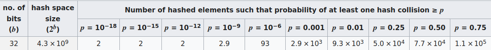

# Security and Deniability

This chapter discusses issues affecting the security and deniability of the PDDB.

## Deniability

Here are some vectors that can reduce the deniability of the PDDB:
  - Ciphertext comparison attacks by an attacker who can capture previous snapshots of the disk
  - API leakage by application programs
  - Free space cache leakage

### Ciphertext Comparison Attacks

An adversary may come across backup archives of the PDDB, or snapshots taken at events such as border crossings or other lawful or unlawful surveillance seizures. With more than one backup file, an adversary could compare the evolution of the ciphertext and noise, and map out which blocks are very likely to be unused, versus ones which have definitely been used. The more frequently snapshots taken, the less deniable things become, to an asymptotic limit of an adversary with a precise log of every write to disk, leading to zero deniability (but you have bigger problems if this has happened).

To counter this, a user may regularly `churn` their device after doing a backup. This is done by running the `pddb churn` command in the `shellchat` app. This will ask the user to unlock all known secret Bases, and then it will:

1. Re-encrypt every used block by "re-noncing" the ciphers
2. Re-write every unused block with a fresh set of noise from the TRNG

This process is not mandated, because it takes about 20-30 minutes to churn all 100MiB of the PDDB, and puts a tax on the write lifetime of the FLASH memory. Alternatively, users may opt to maintain only a single backup file, versus a history of backups.

### API Leakage

A trivial way to defeat all deniability is for an application to do the equivalent of `ls -lr /` and store a copy of that in a non-secret Basis. There is no code or active countermeasure to prevent an application from doing this: Xous takes a minimalist approach and assumes you have only one app on a device, and there is no pushbutton facility to download and run new apps or remote code on the device.

The more likely issue is that deniability-naive apps may try to store a path to a secret file, such as a contact that should be kept secret. When the secret Basis containing the contact is locked (e.g. unmounted), that dangling path reference is a leakage event. An application that reports an error due to the now-missing contact betrays the existence of the contact.

This is a difficult problem that has [been noted previously](https://www.schneier.com/wp-content/uploads/2016/02/paper-truecrypt-dfs.pdf). The PDDB makes it easier for applications to be deniable, and has "safe defaults" which means naive applications will not throw hard errors in the face of common mistakes. However, it does require all application developers to exercise a modicum of restraint when it comes to implementing features such as "Open Recent..." or "Favorites...".

The general rule of thumb is all applications should lean on the PDDB's internal filesystem cache and treat it as the authoritative lookup for things like lists of contacts and files. This requires programmers to "unlearn" the pattern of creating local copies of directory listings to accelerate filesystem operations; it does feel strange to re-query a list of keys every single time you regenerate a UX view. However, this is the right way to implement such code paths while using the PDDB.

### Free Space Cache (FSCB) Leakage

In order to not annoy users and to accelerate allocations, a cache of "definitely free space" is allocated on the PDDB. By default, this cache is set at a maximum of 50% of the actual remaining free space ±10%, and is further limited to the capacity of the cache itself, which is about 7% of peak capacity. Thus, the default settings strongly favor user convenience over deniability. A more paranoid setting might set the cache to something like 10% of the actual remaining free space ±10%.

However, these settings work well for applications where the PDDB is only lightly used. In particular, this works well for password vault and pure crypto wallet applications, where relatively tiny amounts (a few megabytes in aggregate) of sensitive cryptographic matter are stored in the PDDB.

This model breaks down quickly in the case of a chat device that is heavily used, especially if rich media types like images are stored in the PDDB. From a chat perspective, the device is usable for pure text-based chats and interviews, where the logs may consist of some hundreds of kilobytes of text-only data. But users who require trading items such as numerous high-resolution photographs or videos in a deniable fashion would be strongly advised to exercise caution, as these rich media types rapidly overflow the PDDB and lead to a degredation of deniability.

Some may argue that's a feature, not a bug.

### Page Table Collision Leakage

The page table nonce is cryptographically "tiny": just 32 bits. Its goal is to mask identical page numbers and flags from being encrypted to the same ciphertext.

If two identical page table entries from different Bases were to randomly be assigned an identical nonce, and if somehow they had the same encryption key, they would yield the same ciphertext. This would betray the existence of at least one secret basis. However, because the encryption key is derived from a unique name-and-password combo, you would need both a key and a nonce that collides to generate the same ciphertext.

More practically, a Basis page table entry may be assigned the same nonce upon re-encryption after being updated to a new location in physical memory. This means there is a chance that an adversary who has historical snapshots of a PDDB could do a ciphertext analysis of the page table and have a practical chance of finding two entries that have the same ciphertext. This would allow them to deduce that this entry corresponds to a valid page table entry, but it would not allow them to say which page or Basis it belongs to.

The table below, derived from [wikipedia](https://en.wikipedia.org/wiki/Birthday_problem), indicates the scale of the problem.

Assuming that about 10,000 independent but identically virtually-addressed page table entries are updated between each backup (e.g. half the PDDB is turned over but with perfect re-use of the address space), an adversary has about a 1% chance of finding a single colliding pair of ciphertexts between any two backups. However, all the adversary can note is that a particular ciphertext corresponds to some kind of page table entry, but they don't know which Basis, or what part of the Basis.

In the end, the information from differential ciphertext analysis of backup images on the data regions is an orders magnitude larger leakage of data allocation state, so the presumption is that this is a negligible vector. However, an alternative approach would be to use the nonce in a "counter" mode where it is incrementing. This would guarantee no collisions, until the counter rolled over at 4 billion re-allocation events, at which point, the ciphertext pattern would repeat. This is an improvement that will likely be rolled out in a later version of Xous.

## Security

The PDDB has not been formally reviewed by a Cryptographer for security, and the author is not an expert at Cryptography. Use at your own risk.

### Approach

As a matter of philosophy, there are no hand-rolled ciphers in the PDDB and we try to use, as much as practical, implementations directly from the [RustCrypto](https://cryptography.rs/) community (the exceptions are the hardware-accelerated core primitives like AES, SHA and Curve25519, required for performance reasons). However, the PDDB itself is a novel construction and could very likely have issues.

### Known Issues

The AES-GCM-SIV construction in particular was revealed to have a problem known as [Salamanders](https://keymaterial.net/2020/09/07/invisible-salamanders-in-aes-gcm-siv/). This has been worked around by requiring a key commitment in the root page of the cryptographic Bases. However, our implementation of a key commitment *is* hand-rolled, because there isn't a committee-blessed standard on how to do this (yet). We do follow the recommendations [in this paper](https://eprint.iacr.org/2020/1456.pdf).

Finally, *all* confidentiality of the PDDB stems solely from the secrecy of the backup password, the boot PIN, and any secret Bases name/password combos. If you don't perform a backup, then the backup password is ostensibly only known to the hardware itself, and it requires an adversary with direct access to the device and its JTAG port to pull off any practical attack to extract the key. See [this FAQ](https://github.com/betrusted-io/betrusted-wiki/wiki/FAQ:-FPGA-AES-Encryption-Key-(eFuse-BBRAM)#can-the-fpga-encryption-key-foil-an-attacker-who-has-unlimited-physical-access-to-my-device) for limitations on using Precursor as a "true HSM".

[There is no other magic](https://en.wikipedia.org/wiki/Kerckhoffs%27s_principle), so protect those keys!
